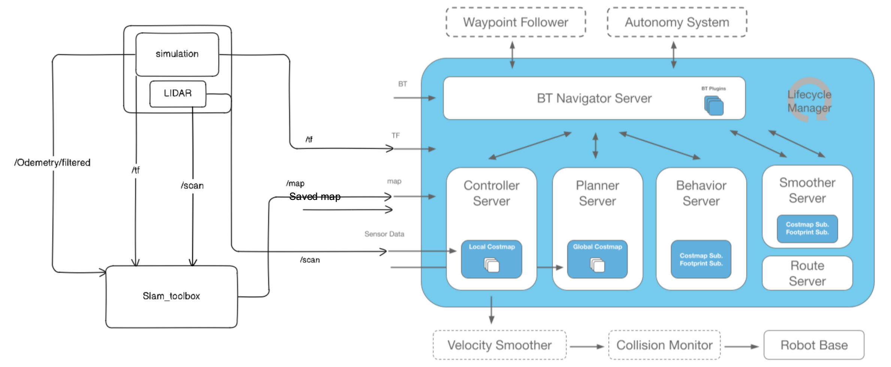
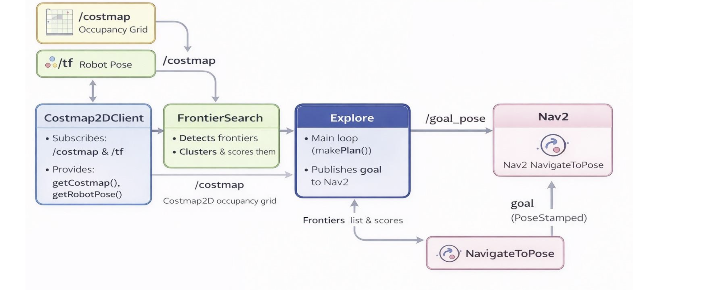
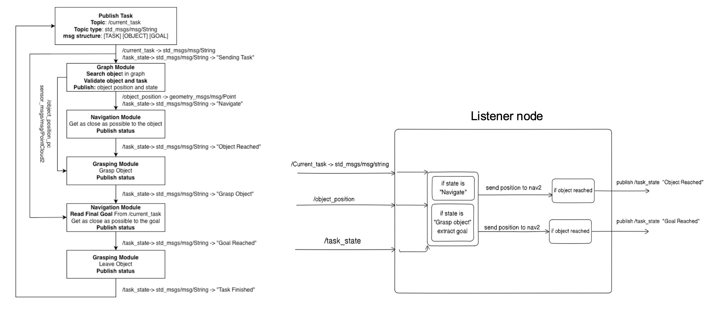

# BP2526_Module3_Group1

## Quick start

### Create workspace

```bash
mkdir ~/husarion_ws
cd ~/husarion_ws
git clone -b ros2 https://github.com/husarion/husarion_ugv_ros.git src/husarion_ugv_ros
```

### Configure environment

Simulation:

```bash
export HUSARION_ROS_BUILD_TYPE=simulation
```

### Build

``` bash
vcs import src < src/husarion_ugv_ros/husarion_ugv/${HUSARION_ROS_BUILD_TYPE}_deps.repos

sudo rosdep init
rosdep update --rosdistro $ROS_DISTRO
rosdep install --from-paths src -y -i

source /opt/ros/$ROS_DISTRO/setup.bash
colcon build --symlink-install --packages-up-to husarion_ugv --cmake-args -DCMAKE_BUILD_TYPE=Release -DBUILD_TESTING=OFF

source install/setup.bash
```


Simulation:

```bash
ros2 launch husarion_ugv_gazebo simulation.launch.py
```


### LIDAR Configuration 

we have edited the component.yaml to add the LIDAR 

component.yaml:
```yaml
components:
  - type: LDR06
    parent_link: base_link  
    xyz: 0.15 0.0 0.25    
    rpy: 0.0 0.0 0.0        
    frequency: 10.0       
    horizontal_samples: 720  
    horizontal_fov: 3.14159 
    range_min: 0.12        
    range_max: 12.0        
    noise_stddev: 0.01    
    topic: /scan           
    frame_id: laser_front_link 
```    


then build again with colcon to accept the new changes 

```bash
colcon build --symlink-install --packages-up-to husarion_ugv --cmake-args -DCMAKE_BUILD_TYPE=Release -DBUILD_TESTING=OFF
```


### Slam_toolbox Download 

```bash
sudo apt install ros-humble-slam-toolbox
```


Slam_toolbox Launch:
```bash
ros2 launch slam_toolbox online_async_launch.py use_sim_time:=true
```
 
> we used the argument use_sim_time:=true to subscripe to the /clock topic to use the simulation clock not the real time clock


then add the map to Rviz but we had a problem with the map because we were subscriping the wrong topic and the default topic for Slam_toolbox is  /scan  so after correcting this we got every thing setup and working 


## Custom Exploration and Naviagtion node


### Nav2 Download 

```bash
sudo apt install -y ros-$ROS_DISTRO-navigation2 ros-$ROS_DISTRO-nav2-bringup
```

github:  https://github.com/ros-navigation/navigation2


### Nav2 launch (slam_toolbox + nav2)

```bash
ros2 launch nav2_bringup bringup_launch.py use_sim_time:=True  params_file:=/src/husarion_ugv_ros/husarion_ugv_gazebo/config/nav2_params.yaml
```


### Nav2 launch (saved map + nav2)

```bash
ros2 launch nav2_bringup bringup_launch.py use_sim_time:=True map:=src/husarion_ugv_ros/husarion_ugv_gazebo/maps/fullmap.yaml params_file:=/src/husarion_ugv_ros/husarion_ugv_gazebo/config/nav2_params.yaml

```

### Nav2 params_file modification 

change every /odom topic to be /odometry/filtered
```yaml
velocity_smoother:
  odom_topic: "/odometry/filtered"


bt_navigator:
  ros__parameters:
    odom_topic: /odometry/filtered
```


configure all nav2 servers to work with /cmd_vel msg type geometry_msgs/msg/TwistStamped  instead of geometry_msgs/msg/Twist 
```yaml
bt_navigator:
  ros__parameters:
    enable_stamped_cmd_vel: true

controller_server:
  ros__parameters:
    enable_stamped_cmd_vel: true    

behavior_server:
  ros__parameters:
    enable_stamped_cmd_vel: true


velocity_smoother:
  ros__parameters:
    enable_stamped_cmd_vel: true


collision_monitor:
  ros__parameters:
    enable_stamped_cmd_vel: true


docking_server:
  ros__parameters:
    enable_stamped_cmd_vel: true    
```


configure the inflation radius and the robot radius to match the robot 
```yaml
global_costmap:
  global_costmap:
    ros__parameters:
      robot_base_frame: base_link
      robot_radius: 0.6 #0.22
      resolution: 0.05

      inflation_layer:
        cost_scaling_factor: 10.0 #3.0
        inflation_radius: 0.5 #0.7

local_costmap:
  local_costmap:
    ros__parameters:
      global_frame: odom
      robot_base_frame: base_link
      resolution: 0.05
      robot_radius: 0.55 #0.22

      inflation_layer:
        plugin: "nav2_costmap_2d::InflationLayer"
        cost_scaling_factor: 8.0 #3.0
        inflation_radius: 0.5

```


### Nav2 architecture





### explore_lite install
```bash
git clone https://github.com/robo-friends/m-explore-ros2.git
```

```bash
cd m-explore-ros2
source install/setup.bash
colcon build --symlink-install
```

### explore_lite launch (after launching nav2)

```bash
ros2 launch explore_lite explore.launch.py
```




## project Integration

